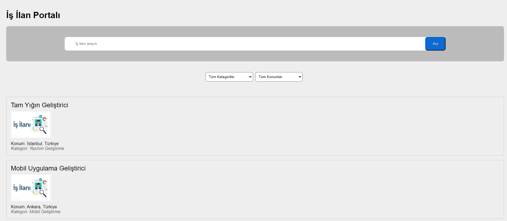

# İş İlan Uygulaması

Bu proje, kullanıcıların iş ilanlarını arayabileceği, filtreleyebileceği ve detaylarını görüntüleyebileceği bir iş ilan portalıdır. React ve Redux kullanılarak geliştirilmiştir.

## Özellikler

- İş ilanlarını arama
- Kategori ve konuma göre filtreleme
- İş ilanlarının detaylarını görüntüleme
- Kullanıcı dostu arayüz

## Kurulum

### Gereksinimler

- Node.js (v14 veya üstü)
- npm veya yarn

### Adımlar

1. Depoyu klonlayın:

```bash
git clone https://github.com/seher-akbas/Is-Ilan-Uygulamasi.git

2. Proje dizinine gidin:

cd C:\Users\Username\Masaüstü\Is-Ilan-Uygulamasi\ilan-uygulama

3. Gerekli paketleri yükleyin:

npm install
# veya
yarn install

4. Projeyi başlatın:

npm run dev
# veya
yarn dev

Kullanım

Ana sayfada, arama kutusunu kullanarak iş ilanlarını arayabilirsiniz.
Kategori ve konum filtreleme seçeneklerini kullanarak aramanızı daraltabilirsiniz.
İş ilanı kartına tıklayarak detaylarını görüntüleyebilirsiniz.

Proje Yapısı

src/components: Uygulama bileşenleri
  IlanList.js: İş ilanı listesini görüntüleyen bileşen
  IlanKartları.js: Her bir iş ilanı kartı bileşeni
  IlanDetay.js: İş ilanı detay bileşeni

src/app: Redux store dosyası
  store.js: Redux store yapılandırması

src/features: Redux slice'ları ve ilgili dosyalar
  filterSlice.js: Filtreleme işlemleri için Redux slice

src/assets: Uygulama için kullanılan resimleri içerir

